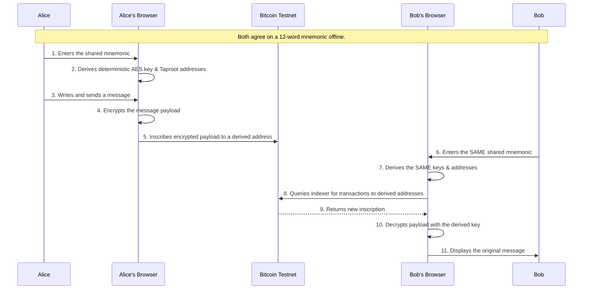

#  Ephemeral Protocol 

### Deniable, Uncensorable, One-Shot Messaging on Bitcoin.

**[Live Demo on Vercel](https://ephemeral-labs.vercel.app/)**

Ephemeral is a minimalist, privacy-first messaging protocol that transforms the Bitcoin blockchain into a secure, serverless, and anonymous communication channel.

Two parties, sharing nothing but a **12-word secret phrase**, can establish an end-to-end encrypted channel. All messages are inscribed on-chain as encrypted, seemingly random data. Without the shared secret, the messages are undiscoverable and unreadable. **No accounts, no servers, no metadata.**

This project was built for the **Weapons of Liberation - Freedom Apps on Bitcoin** hackathon.

---

## Ephemeral Protocol Showcase


---

## The Philosophy: What if a message never existed?

In a world of constant surveillance, true privacy isn't just about encrypting content—it's about **deniability**. Ephemeral explores this concept by leaving no trace of a user's identity. The protocol is designed for journalists, activists, and individuals in high-risk environments where even the *existence* of a messaging app can be a liability.

With Ephemeral, your "identity" is a temporary key derived from a secret you hold only in your mind. The blockchain is merely a public bulletin board where you post encrypted notes that only your intended recipient can ever find or decipher.

## Why Bitcoin? The Foundation of Freedom

Ephemeral was built on Bitcoin by design, not by chance. While other blockchains might offer higher speed, Bitcoin provides what truly matters for a "Weapon of Liberation":

-   **Unstoppable Immutability:** With over a decade of proven security and a minimal attack surface, Bitcoin is the world's most censorship-resistant ledger. Messages inscribed on Bitcoin are there forever.
-   **Ultimate Sovereignty:** Bitcoin's core ethos is self-sovereignty. Our protocol extends this from finance to communication, aligning perfectly with the hackathon's philosophy.
-   **A Programmable Future with Ordinals:** We see Ordinals not just as collectibles, but as the dawn of a new, programmable layer for Bitcoin. Our project leverages inscriptions as communication primitives, a foundational step in this new ecosystem.

## Key Features

-   🤫 **Deniable & Anonymous:** No user accounts, email, or phone numbers.
-   🔐 **End-to-End Encryption:** Client-side AES-265-GCM encryption via Web Crypto API.
-   ⛓️ **On-Chain & Uncensorable:** Encrypted payloads inscribed on Bitcoin Testnet.
-   💻 **Serverless Architecture:** All operations happen in-browser. Zero user data stored.
-   📱 **Fully Responsive:** Seamless experience on desktop and mobile.
-   🧩 **Wallet Integration:** Native integration with Unisat Wallet.

---

## How It Works: The Core Concept & Technical Flow

The protocol's magic lies in its simplicity and deterministic cryptography. There are two parts to understanding it: the core idea and the technical process.

### The Simple Idea: Shared Secret = Shared Reality

Imagine a key that doesn't open one lock, but creates an entire secret room that only two people can see. The 12-word mnemonic is that key.

```
+--------------------------+                         +--------------------------+
|         ALICE            |                         |           BOB            |
|                          |                         |                          |
|  [ 12-Word Mnemonic ]    |---- SHARED SECRET ----> |  [ 12-Word Mnemonic ]    |
|           |              |                         |           |              |
|           v              |                         |           v              |
|  [ EPHEMERAL APP ]       |                         |  [ EPHEMERAL APP ]       |
|           |              |                         |           |              |
|           v              |                         |           v              |
| [ Identical Keys & ]     |                         | [ Identical Keys & ]     |
| [  Address List    ]     | <----- SYNCED VIA ----> | [  Address List    ]     |
|                          |      BITCOIN CHAIN      |                          |
+--------------------------+                         +--------------------------+
```
Because both Alice and Bob start with the **same secret phrase**, the app on their devices generates the **exact same encryption keys and the exact same list of secret "mailbox" addresses**. They are looking at the same invisible map, synchronized only by the math of Bitcoin.

### The Technical Flow: Step-by-Step

This diagram shows the end-to-end process of sending and receiving a message.



## Tech Stack
-   **Framework:** Next.js 14 & TypeScript
-   **Styling:** Tailwind CSS
-   **Bitcoin Logic:** `bitcoinjs-lib`
-   **Cryptography:** Web Crypto API
-   **Wallet Connector:** Unisat Wallet Web API

---

## Getting Started: Run It Locally
**Prerequisites:** Node.js, npm/yarn, Unisat Wallet, and some Testnet BTC.

**1. Clone & Install:**
```bash
git clone https://github.com/furkngld/ephemeral.git
cd ephemeral
npm install
```
**2. Run Server:**
```bash
npm run dev
```
Open [http://localhost:3000](http://localhost:3000).

**3. Test Flow:**
- Open two browser windows.
- Generate and enter the same 12-word mnemonic in both.
- Connect Unisat Wallet (on Testnet).
- Send a message from one window and approve the transaction.
- Click "Fetch Inbox" in the other window to see the decrypted message appear.

---

## 🛡️ Security & Limitations

-   ⚠️ **Testnet Only:** This is a proof-of-concept. Do not use a mnemonic associated with real funds.
-   **Mnemonic Security:** The secrecy of the mnemonic is critical. Never share it digitally.
-   **No Forward Secrecy (Yet):** In the current implementation, a compromised mnemonic reveals all past and future messages. This is a key focus of our future roadmap.
-   **Centralized Indexer:** The app currently relies on public indexers to find messages.

## Future Roadmap: Deep Integration with Open Ordinal

This proof-of-concept lays the groundwork for a truly sovereign communication tool. Our next steps are focused on leveraging the **Open Ordinal** stack to build a robust, scalable protocol. Our initial planning for these integrations can be found in `src/lib/open-ordinal-integration.ts`.

-   #### Phase 1: Unlimited Message Size via Open Ordinal Stitch
    **Problem:** The current `OP_RETURN` limit is ~80 bytes.  
    **Solution:** We will integrate **Open Ordinal Stitch** to enable message chunking, allowing for seamless communication of any length.

-   #### Phase 2: Decentralized Indexing with Open Ordinal API
    **Problem:** Reliance on centralized indexers.  
    **Solution:** We will replace public indexers with direct queries via the **Open Ordinal API**, increasing privacy and censorship resistance.

-   #### Phase 3: Advanced Features with Open Ordinal Bootstrap
    **Problem:** On-chain logic is limited.  
    **Solution:** We will explore **Open Ordinal Bootstrap** to embed on-chain parsers and enable advanced features like recursive message threads.

---
## License

This project is licensed under the MIT License. See the [LICENSE](LICENSE) file for details.

THE SOFTWARE IS PROVIDED "AS IS", WITHOUT WARRANTY OF ANY KIND, EXPRESS OR IMPLIED.
---
Built with ❤️ for a free and open internet.
